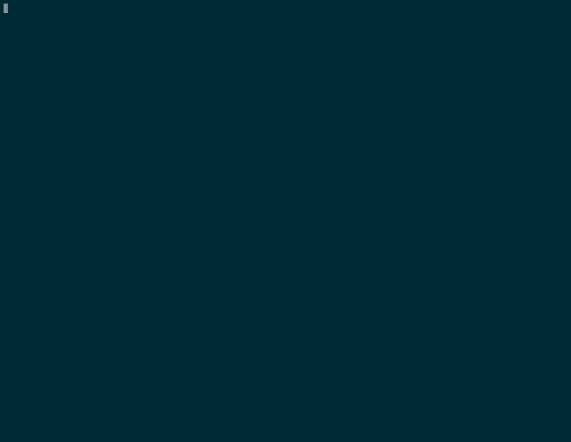

# kubeseal-auto

The script is an interactive wrapper for kubeseal binary used to encrypt secrets for [sealed-secrets](https://github.com/bitnami-labs/sealed-secrets).



## Installation
The recommended way to install this script is [pipx](https://github.com/pypa/pipx):

```bash
pipx install kubeseal-auto
```

## Usage
By default, the script will check the version of sealed-secret controller and download the corresponding kubeseal binary to ~/bin directory.

To run the script in fully interactive mode:
```bash
kubeseal-auto
```

Additionally, a "detached" mode is supported:
```bash
# Download sealed-secrets certificate for local signing
kubeseal-auto --fetch
# Generate SealedSecret with local certificate
kubeseal-auto --cert <kubectl-context>-kubeseal-cert.crt
```
> Note: In the detached mode kubeseal-auto will not download the kubeseal binary and will look for it in the system $PATH.

To select kubeconfig context:
```bash
kubeseal-auto --select
```

To append or change key values in the existing secret:
```bash
kubeseal-auto --edit secret-name.yaml
```

To reencrypt all secrets in a directory (not working in a detached mode):
```bash
kubeseal-auto --reencrypt /path/to/directory
```

To back up the encryption and decryption keys (not working in a detached mode):
```bash
kubeseal-auto --backup
```

## Contributing
Pull requests are welcome. For major changes, please open an issue first to discuss what you would like to change.
